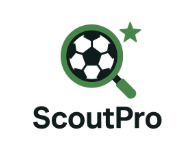
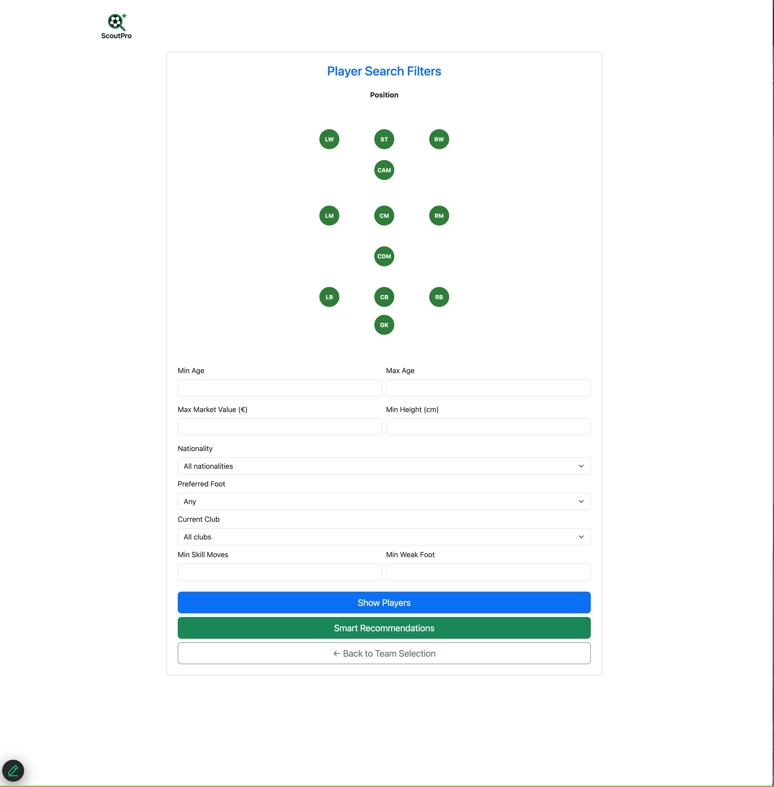
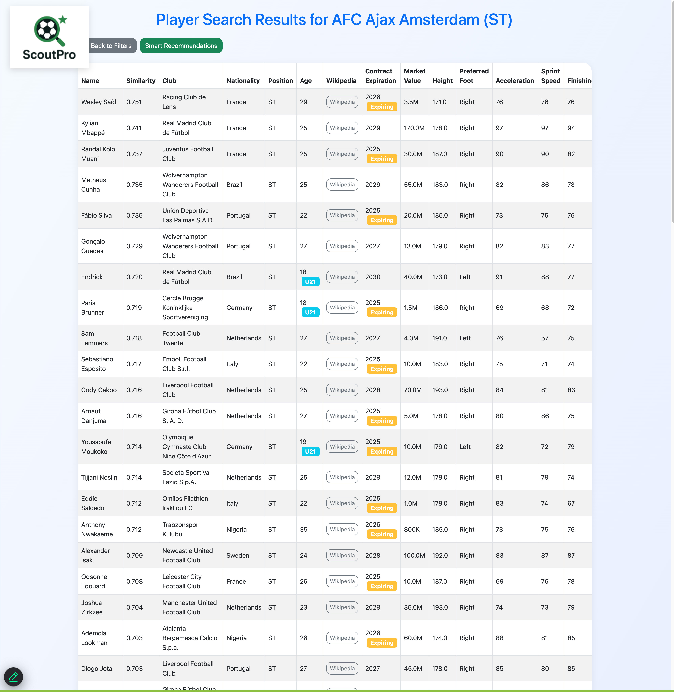
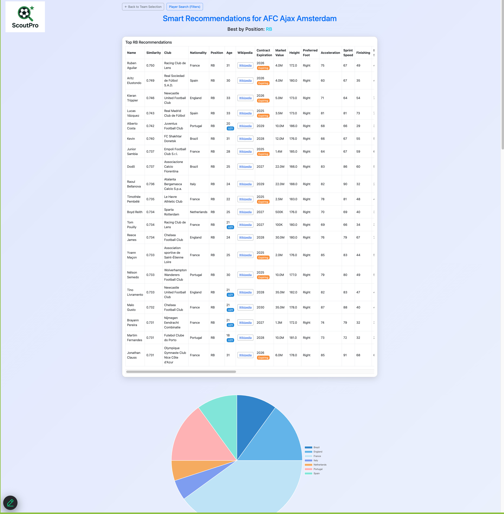

# ScoutPro
ScoutPro
Smarter scouting. Data-driven decisions. Game-changing results.
Modern football is driven by data. Clubs manage hundreds of player profiles.
Traditional scouting is often subjective, inconsistent, and time-consuming.
There’s a growing need for tools that help scouts make fast, data-driven decisions.
ScoutPro was built to fill this gap - giving every scout the power of smart analysis.

&nbsp; 
## Documentation

You can find all the documentation in the following files:

- [Installation Guide](install.md)
- [Project Summary](summary.md)
- [Modules Description](modules.md)

&nbsp; 
## About

This project is developed for the *Recommender Systems Workshop* at Tel Aviv University.  
More information can be found on the [Workshop Website](https://courses.cs.tau.ac.il/recsys/).

### Authors

- Adi Lazarovici — adilazarovich282@gmail.com  
- Ilay Falach — ilayfalach99@gmail.com  
- Yonathan Panov - yonathan.atid@gmail.com
- Tal Attias - talattias@mail.tau.ac.il

&nbsp;

## Screenshots

Here is a screenshot of the application interface:

